# RFly One

## Introduction
This project was inspired by [adsbee](https://github.com/PantsForBirds/adsbee) and [SoftRF](https://github.com/PantsForBirds/adsbee)!

This is the RFly One! This project was designed to be a fully offline general aviation proximity awareness system. The RFly One includes a custom ADS-B 1090MHz receiver frontend and support for FLARM AIR V7, OGNTP, FANET+ and more protocols, designed to keep pilots or enthusiasts aware of nearby manned or unmanned aerial vehicles without relying on an active internet connection.

The RFly One has a 2.4" TFT display to show nearby air traffic on an offline map (which can be loaded onto the SD card) or used as a flight insturment dashboard. It also has a BMI270 IMU and a MMC5983MA magnetometer to provide accurate heading, combined with an ATGM332D-5N31 GNSS module to show the current location on a map.

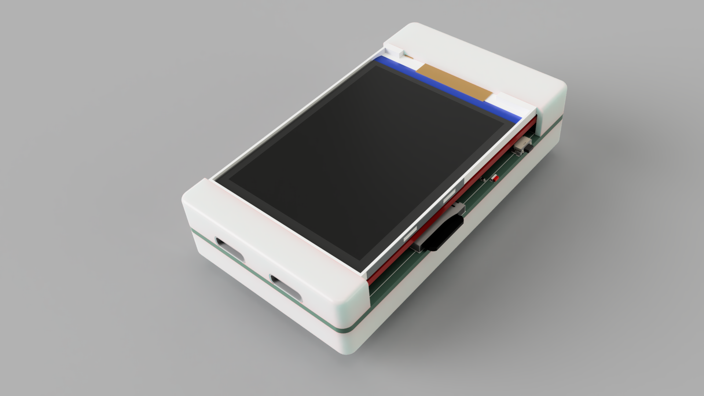
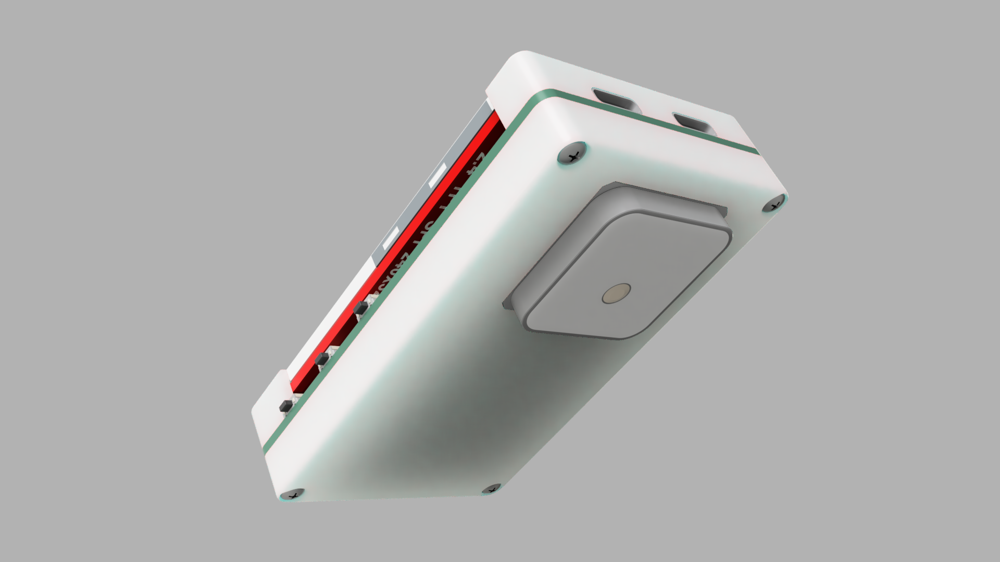
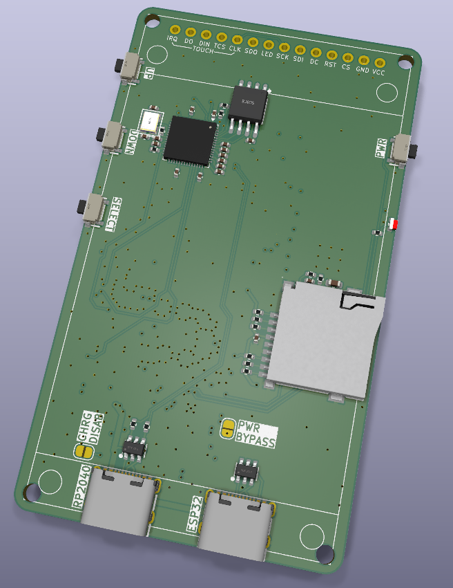
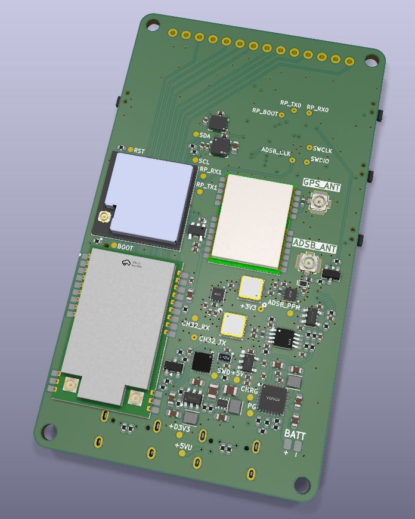

## Specifications

### Features
* **Awareness Protocols:** ADS-B, FLARM AIR V7, OGNTP, FANET+, RemoteID
* **Positioning:** GNSS, Gyro, Accelerometer, Magnetometer
* **Storage:** MicroSD Card (For offline maps)
* **Charging:** 2A Max

### Hardware
* **Main Processor** ESP32-S3
* **ADS-B Decoder:** RP2040
* **Button/Power Control:** CH32V003
* **GNSS:** ATGM332D-5N31
* **IMU:** BMI270
* **Magnetometer:** MMC5983MA
* **LoRa Radio:** E80-900M2212S (LR2021)
* **Display:** 2.4" TFT

## Pinout
| Header | Pin name | MCU Pin | Description |
|---|---|---|---|
| **[PLACEHOLDER]** | `[PLACEHOLDER]` | `[PLACEHOLDER]` | `[PLACEHOLDER]` |
| **[PLACEHOLDER]** | `[PLACEHOLDER]` | `[PLACEHOLDER]` | `[PLACEHOLDER]` |
| **[PLACEHOLDER]** | `[PLACEHOLDER]` | `[PLACEHOLDER]` | `[PLACEHOLDER]` |

----

## Hardware Overview

### RFly One Mainboard
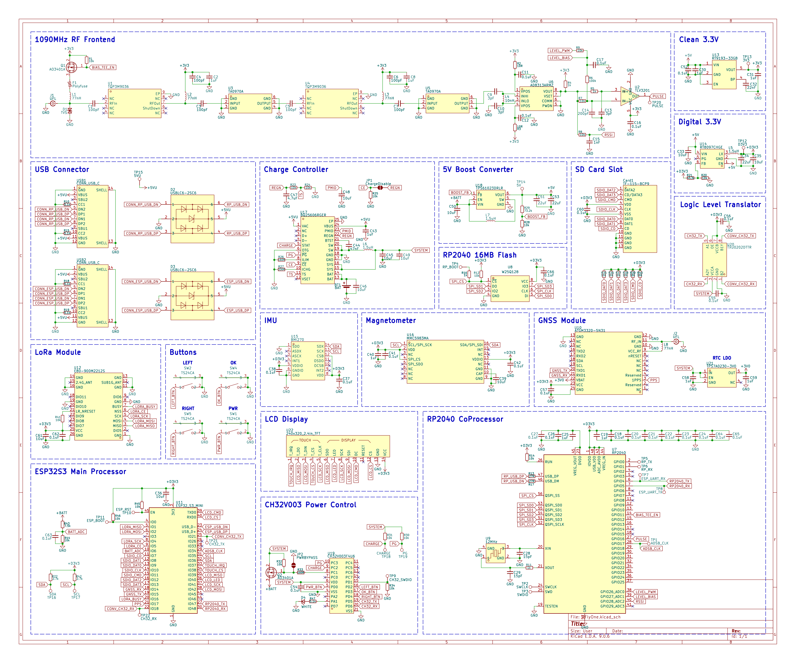
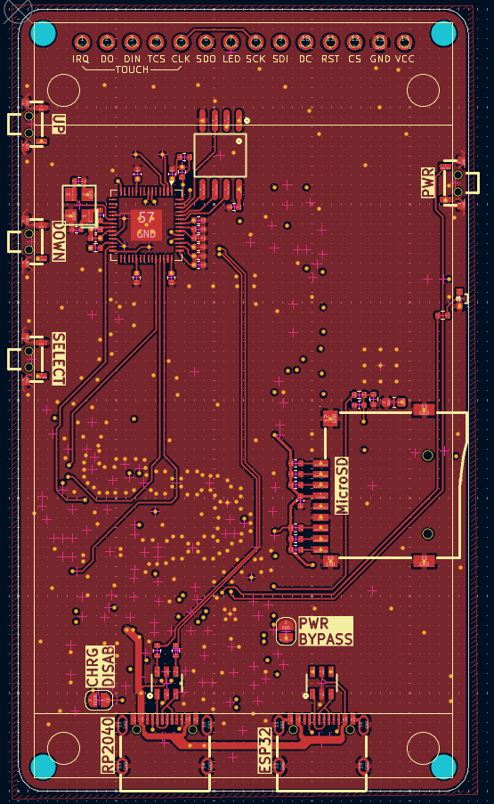
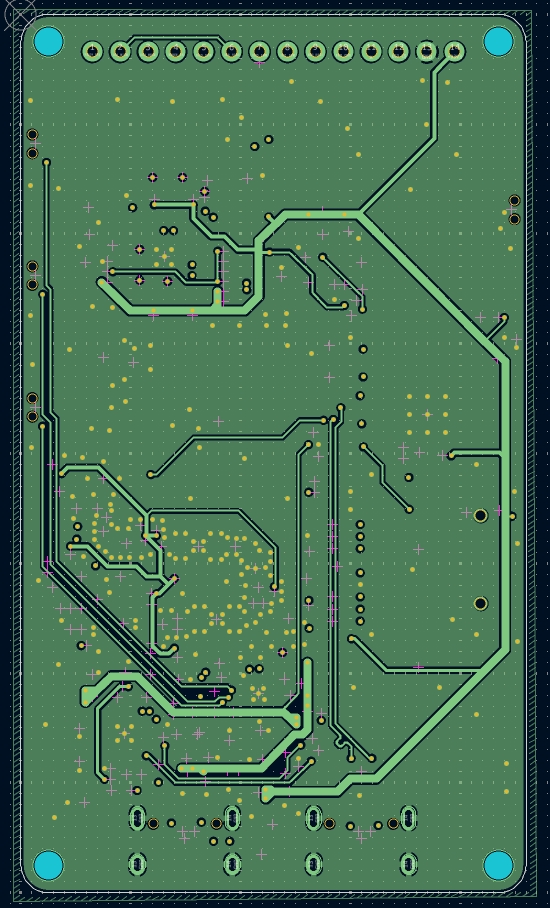
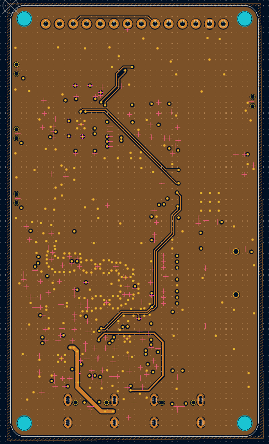
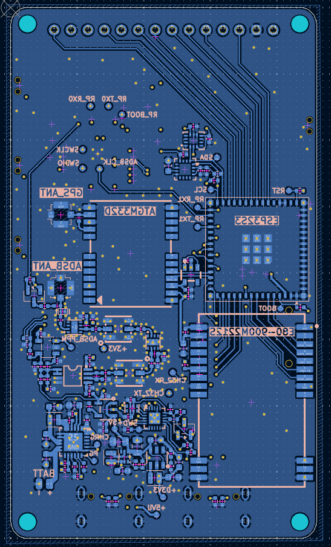

----

## Firmware Compilation & Flashing

> [!IMPORTANT]
> The software build process relies on separate firmware targets for the RP2040 (handling UI, Map rendering, and ADS-B decoding) and the CH32V003 (handling power state and buttons). 

### Building the RP2040 Firmware
1. `[PLACEHOLDER - Clone repository instructions]`
2. `[PLACEHOLDER - CMake and build instructions]`
3. `[PLACEHOLDER - Output file location]`

### Building the CH32V003 Firmware
1. `[PLACEHOLDER - Clone repository instructions]`
2. `[PLACEHOLDER - Toolchain requirements]`
3. `[PLACEHOLDER - Build commands]`

### Flashing the Device
1. **RP2040:** `[PLACEHOLDER - BOOTSEL instructions for UF2 drag-and-drop]`
2. **CH32V003:** `[PLACEHOLDER - WCH-LinkE or SWD flashing instructions]`

----

## Assembly

### Component List
* **Shell:**
    - [TopCase1.stl](https://github.com/YeetTheAnson/RFly-One/tree/main/production/3dPrint/TopCase1.stl)
    - [TopCase2.stl](https://github.com/YeetTheAnson/RFly-One/tree/main/production/3dPrint/TopCase2.stl)
    - [BottomCase.stl](https://github.com/YeetTheAnson/RFly-One/tree/main/production/3dPrint/BottomCase.stl)
* **PCB:**
    - [RFlyOne.zip](https://github.com/YeetTheAnson/RFly-One/tree/main/production/PCB/RFlyOne.zip)  
* **Fasteners:** 4x M2 10mm Self Tapping Screws
* **Battery:** Generic 500mAh LiPo battery (Size of battery is your choice)
* **SD Card:** Generic micro SD Card

### Assembly Instructions
1. Slide the 3d printed parts `TopCase1.stl` and `TopCase2.stl` into place underneath the TFT LCD board.

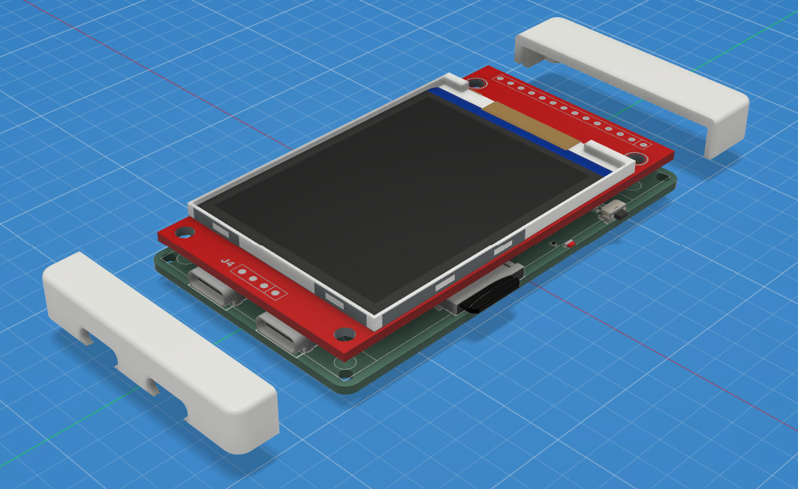
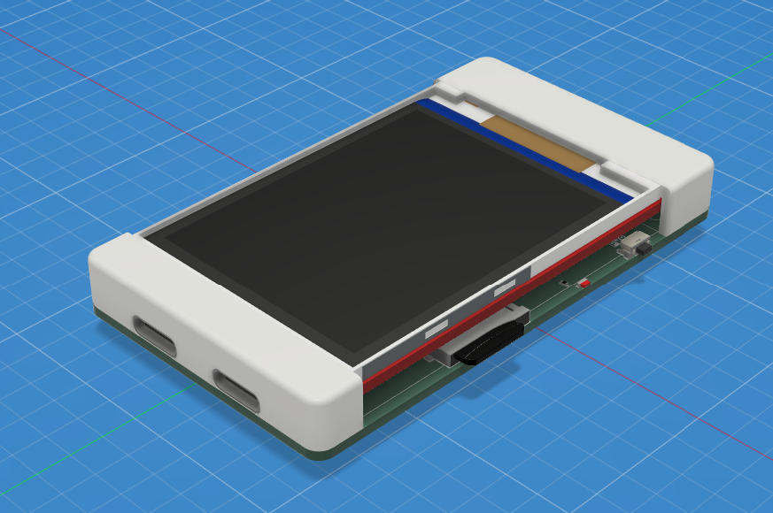

2. Attach the battery using double sided adhesives and solder the battery cable onto the dedicated pad. Then connect the 2.4GHz WiFi antenna, 2.4GHz LoRa antenna, 1090MHz ADSB antenna and 900MHz LoRa antenna, and secure the FPC antennae to `BottomCase.stl` using double sided adhesives.

3. Feed the GNSS antenana cable through the `BottomCase.stl` cutout and glue the antenna to the bottom case. Then connect the GNSS antenna connector to the PCB and close the case.

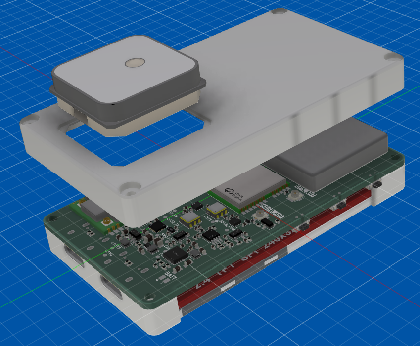
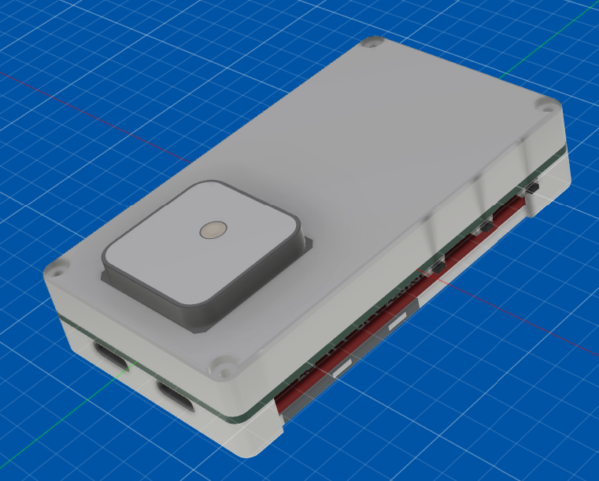

4. Secure the case using 4x M2 10mm Self Tapping Screws

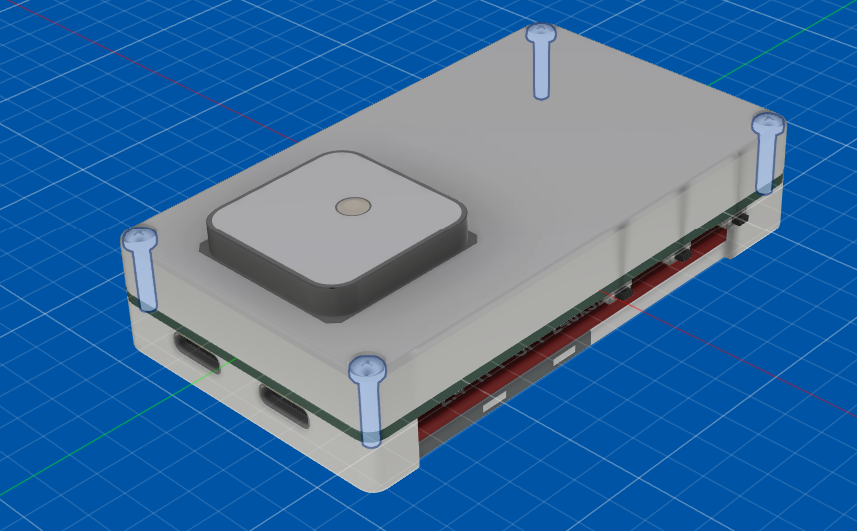

----

## Bill of Material

| Category | Item Name | Description | Link | Vendor | Quantity | Total Price (USD) |
|---|---|---|---|---|---:|---:|
| Core MCU | RP2040 | Main coprocessor | `[PLACEHOLDER]` | `[PLACEHOLDER]` | 1 | `[PLACEHOLDER]` |
| Core MCU | CH32V003 | Power management MCU | `[PLACEHOLDER]` | `[PLACEHOLDER]` | 1 | `[PLACEHOLDER]` |
| Radio | E80-900M2212S | LR2021 LoRa module | `[PLACEHOLDER]` | `[PLACEHOLDER]` | 1 | `[PLACEHOLDER]` |
| Location | ATGM332D-5N31 | GNSS Module | `[PLACEHOLDER]` | `[PLACEHOLDER]` | 1 | `[PLACEHOLDER]` |
| Sensor | BMI270 | IMU | `[PLACEHOLDER]` | `[PLACEHOLDER]` | 1 | `[PLACEHOLDER]` |
| Sensor | MMC5983MA | Magnetometer | `[PLACEHOLDER]` | `[PLACEHOLDER]` | 1 | `[PLACEHOLDER]` |
| Display | 2.4" TFT | SPI Display | `[PLACEHOLDER]` | `[PLACEHOLDER]` | 1 | `[PLACEHOLDER]` |
| Power | bq25606 | Charge controller | `[PLACEHOLDER]` | `[PLACEHOLDER]` | 1 | `[PLACEHOLDER]` |
| Power | `[PLACEHOLDER]` | 3.3V Buck Converter | `[PLACEHOLDER]` | `[PLACEHOLDER]` | 1 | `[PLACEHOLDER]` |
| Power | `[PLACEHOLDER]` | 5V Boost Converter | `[PLACEHOLDER]` | `[PLACEHOLDER]` | 1 | `[PLACEHOLDER]` |
| RF Frontend | `[PLACEHOLDER]` | LNAs and SAW Filters | `[PLACEHOLDER]` | `[PLACEHOLDER]` | 1 | `[PLACEHOLDER]` |