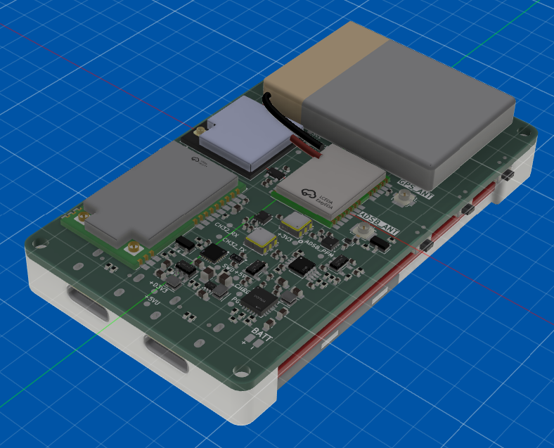

# RFly One

## Introduction
This project was inspired by [adsbee](https://github.com/PantsForBirds/adsbee) and [SoftRF](https://github.com/PantsForBirds/adsbee)!

This is the RFly One! This project was designed to be a fully offline general aviation proximity awareness system. The RFly One includes a custom ADS-B 1090MHz receiver frontend and support for FLARM AIR V7, OGNTP, FANET+ and more protocols, designed to keep pilots or enthusiasts aware of nearby manned or unmanned aerial vehicles without relying on an active internet connection.

The RFly One has a 2.4" TFT display to show nearby air traffic on an offline map (which can be loaded onto the SD card) or used as a flight insturment dashboard. It also has a BMI270 IMU and a MMC5983MA magnetometer to provide accurate heading, combined with an ATGM332D-5N31 GNSS module to show the current location on a map.

## Specifications

### Features
* **Awareness Protocols:** ADS-B, FLARM AIR V7, OGNTP, FANET+, RemoteID
* **Positioning:** GNSS, Gyro, Accelerometer, Magnetometer
* **Storage:** MicroSD Card (For offline maps and flight logging)
* **Charging:** 2A Max

### Hardware
* **Main Processor** ESP32-S3
* **ADS-B Decoder:** RP2040
* **Button/Power Control:** CH32V003
* **GNSS:** ATGM332D-5N31
* **IMU:** BMI270
* **Magnetometer:** MMC5983MA
* **LoRa Radio:** E80-900M2212S (LR2021)
* **Display:** 2.4" TFT

## Pinout
| Feature | Pin name | ESP32 Pin | Description |
|---|---|---|---|
| **LCD** | `LCD_MOSI` | `GPIO 42` | SPI MOSI |
| | `LCD_MISO` | `GPIO 39` | SPI MISO |
| | `LCD_SCK` | `GPIO 41` | SPI Clock |
| | `LCD_CS` | `GPIO 44` | SPI Chip Select |
| | `LCD_LED` | `GPIO 40` | Backlight Control |
| | `LCD_CMD` | `GPIO 43` | LCD Command |
| **IMU** | `SDA` | `GPIO 36` | I2C Data |
| | `SCL` | `GPIO 35` | I2C Clock |
| **SD Card** | `SDIO_DAT0` | `GPIO 9` | Data 0 |
| | `SDIO_DAT1` | `GPIO 8` | Data 1 |
| | `SDIO_DAT2` | `GPIO 12` | Data 2 |
| | `SDIO_DAT3` | `GPIO 13` | Data 3 |
| | `SDIO_CMD` | `GPIO 11` | SD Command |
| | `SDIO_CD` | `GPIO 7` | SD Detect |
| | `SDIO_CLK` | `GPIO 10` | SD Clock |
| **LoRa Radio** | `LORA_MOSI` | `GPIO 2` | SPI MOSI |
| | `LORA_MISO` | `GPIO 1` | SPI MISO |
| | `LORA_SCK` | `GPIO 4` | SPI Clock |
| | `LORA_CE` | `GPIO 5` | SPI Chip Enable |
| | `LORA_BUSY` | `GPIO 16` | Radio Busy |
| **GNSS Module** | `GNSS_TX` | `GPIO 15` | UART RX |
| | `GNSS_RX` | `GPIO 14` | UART TX |
| | `PPS` | `GPIO 17` | GNSS Time |
| **Button/Power Control** | `CH32_TX` | `GPIO 21` | UART RX |
| | `CH32_RX` | `GPIO 18` | UART TX |
| | `BATT_ADC` | `GPIO 6` | ADC1 |
| **ADSB Decoder** | `RP_TX` | `GPIO 47` | UART RX |
| | `RP_RX` | `GPIO 48` | UART TX |
| | `ADSB_CLK` | `GPIO 34` | Extracted Clock From ADSB Signal |

----

## Hardware Overview

----

## Firmware

### Building the RP2040 Firmware
1. Clone [this repository](https://github.com/YeetTheAnson/RFly-One) and enter the directory `cd RFly-One`
2. Open the `/firmware/source/rp2040.ino` file in ArduinoIDE
3. Paste `https://github.com/earlephilhower/arduino-pico/releases/download/global/package_rp2040_index.json` into `File > Preferences > Additional boards manager URLs`
4. Go to boards manager and install `Raspberry Pi Pico/RP2040/RP2350` by Earle F. Philhower, III
5. Click the upload button or `Sketch > Export Compiled Binary`

### Building the CH32V003 Firmware
1. Clone [this repository](https://github.com/YeetTheAnson/RFly-One) and enter the directory `cd RFly-One`
2. Open the `/firmware/source/ch32v003.ino` file in ArduinoIDE
3. Paste `https://alexandermandera.github.io/arduino-wch32v003/package_ch32v003_index.json` into `File > Preferences > Additional boards manager URLs`
4. Go to boards manager and install `WCH Boards` by Alexander Mandera
5. Click the upload button or `Sketch > Export Compiled Binary`

### Building the ESP32S3 Firmware
1. Clone [this repository](https://github.com/YeetTheAnson/RFly-One) and enter the directory `cd RFly-One`
2. Open the `/firmware/source/esp32.ino` file in ArduinoIDE
3. Paste `https://espressif.github.io/arduino-esp32/package_esp32_index.json` into `File > Preferences > Additional boards manager URLs`
4. Go to boards manager and install `ESP32` by Espressif
5. Click the upload button or `Sketch > Export Compiled Binary`

----

## Assembly

### Component List
* **Shell:**
    - [TopCase1.stl](https://github.com/YeetTheAnson/RFly-One/tree/main/production/3dPrint/TopCase1.stl)
    - [TopCase2.stl](https://github.com/YeetTheAnson/RFly-One/tree/main/production/3dPrint/TopCase2.stl)
    - [BottomCase.stl](https://github.com/YeetTheAnson/RFly-One/tree/main/production/3dPrint/BottomCase.stl)
* **PCB:**
    - [RFlyOne.zip](https://github.com/YeetTheAnson/RFly-One/tree/main/production/PCB/RFlyOne.zip)  
* **Fasteners:** 4x M2 10mm Self Tapping Screws
* **Battery:** Generic 500mAh LiPo battery (Size of battery is your choice)
* **SD Card:** Generic micro SD Card
* **Antennae:**
    - 2x 2400MHz FPC Antenna
    - 1x 1090MHz FPC Antenna
    - 1x 900MHz FPC Antenna
    - 1x Active GPS Ceramic Antenna

### Assembly Instructions
1. Slide the 3d printed parts `TopCase1.stl` and `TopCase2.stl` into place underneath the TFT LCD board.

2. Attach the battery using double sided adhesives and solder the battery cable onto the dedicated pad. Then connect the 2.4GHz WiFi antenna, 2.4GHz LoRa antenna, 1090MHz ADSB antenna and 900MHz LoRa antenna, and secure the FPC antennae to `BottomCase.stl` using double sided adhesives.

3. Feed the GNSS antenana cable through the `BottomCase.stl` cutout and glue the antenna to the bottom case. Then connect the GNSS antenna connector to the PCB and close the case.

4. Secure the case using 4x M2 10mm Self Tapping Screws

----

## Bill of Material

| Category | Item Name | Description | Link | Vendor | Quantity | Total Price (USD) |
|---|---|---|---|---|---:|---:|
| PCB Components | CL10A106MA8NRNC | 10uF 0603 capacitor | [link](https://www.lcsc.com/product-detail/C96446.html) | LCSC | 20 | 1.52 |
| PCB Components | AO3401A | P channel MOSFET | [link](https://www.lcsc.com/product-detail/C15127.html) | LCSC | 5 | 0.51 |
| PCB Components | GRM1555C1H101JA01D | 100pF 0402 capacitor | [link](https://www.lcsc.com/product-detail/C77177.html) | LCSC | 50 | 0.55 |
| PCB Components | GJM1555C1H3R0BB01D | 3pF 0402 capacitor | [link](https://www.lcsc.com/product-detail/C88891.html) | LCSC | 50 | 0.86 |
| PCB Components | CC0402JRNPO9BN201 | 200pF 0402 capacitor | [link](https://www.lcsc.com/product-detail/C325462.html) | LCSC | 50 | 0.45 |
| PCB Components | CC0402KRX7R9BB102 | 1nF 0402 capacitor | [link](https://www.lcsc.com/product-detail/C106205.html) | LCSC | 100 | 0.23 |
| PCB Components | CC0402JRNPO9BN150 | 15pF 0402 capacitor | [link](https://www.lcsc.com/product-detail/C106997.html) | LCSC | 100 | 0.20 |
| PCB Components | CL21A226MOQNNNE | 22uF 0805 capacitor | [link](https://www.lcsc.com/product-detail/C98190.html) | LCSC | 10 | 1.06 |
| PCB Components | RClamp3361P-ES | 0.25pF DFN1006 TVS diode | [link](https://www.lcsc.com/product-detail/C22464622.html) | LCSC | 5 | 0.60 |
| PCB Components | 0402L020/6SR | 200mA 0402 PTC Fuse | [link](https://www.lcsc.com/product-detail/C53280164.html) | LCSC | 10 | 0.71 |
| PCB Components | LQW15CN77NJ10D | 77nH 0402 inductor | [link](https://www.lcsc.com/product-detail/C668466.html) | LCSC | 10 | 0.88 |
| PCB Components | LQG15HS10NJ02D | 10nH 0402 inductor | [link](https://www.lcsc.com/product-detail/C77103.html) | LCSC | 50 | 0.93 |
| PCB Components | RC0402FR-0727RL | 27R 0402 resistor | [link](https://www.lcsc.com/product-detail/C138021.html) | LCSC | 100 | 0.40 |
| PCB Components | RC0402FR-0745K3L | 45.3k 0402 resistor | [link](https://www.lcsc.com/product-detail/C137977.html) | LCSC | 100 | 0.17 |
| PCB Components | FRC0402F2701TS | 2.7k 0402 resistor | [link](https://www.lcsc.com/product-detail/C2909332.html) | LCSC | 100 | 0.19 |
| PCB Components | FRC0402F1600TS | 160R 0402 resistor | [link](https://www.lcsc.com/product-detail/C2933075.html) | LCSC | 100 | 0.18 |
| PCB Components | FRC0402F3300TS | 330R 0402 resistor | [link](https://www.lcsc.com/product-detail/C2930002.html) | LCSC | 100 | 0.22 |
| PCB Components | FRC0402F7322TS | 73.2k 0402 resistor | [link](https://www.lcsc.com/product-detail/C2998163.html) | LCSC | 100 | 0.19 |
| PCB Components | 0402WGF7501TCE | 7.5k 0402 resistor | [link](https://www.lcsc.com/product-detail/C25918.html) | LCSC | 100 | 0.22 |
| PCB Components | ABM8-272-T3 | 12MHz 10pF 3225 crystal | [link](https://www.lcsc.com/product-detail/C20625731.html) | LCSC | 1 | 0.63 |
| PCB Components | ATGM332D-5N31 | GNSS module | [link](https://www.lcsc.com/product-detail/C128659.html) | LCSC | 1 | 3.58 |
| PCB Components | BMI270 | IMU | [link](https://www.lcsc.com/product-detail/C2836813.html) | LCSC | 2 | 5.75 |
| PCB Components | BQ25606RGER | Battery charge controller | [link](https://www.lcsc.com/product-detail/C374063.html) | LCSC | 1 | 1.64 |
| PCB Components | MMC5983MA | Magnetometer | [link](https://www.lcsc.com/product-detail/C404329.html) | LCSC | 1 | 2.28 |
| PCB Components | RT9193-33GB | 3.3V LDO regulator | [link](https://www.lcsc.com/product-detail/C15651.html) | LCSC | 5 | 0.69 |
| PCB Components | TA0970A | 1090MHz SAW filter | [link](https://www.lcsc.com/product-detail/C7115531.html) | LCSC | 2 | 3.09 |
| PCB Components | TLV3201AIDBVR | Comparator | [link](https://www.lcsc.com/product-detail/C105188.html) | LCSC | 1 | 0.98 |
| PCB Components | TPS61023DRLR | Boost converter | [link](https://www.lcsc.com/product-detail/C919459.html) | LCSC | 5 | 1.24 |
| PCB Components | TPS7A0230PDBVR | ULC 3V LDO regulator | [link](https://www.lcsc.com/product-detail/C3747031.html) | LCSC | 1 | 0.45 |
| PCB Components | TQP3M9036 | LNA | [link](https://www.lcsc.com/product-detail/C920261.html) | LCSC | 2 | 6.29 |
| PCB Components | TXU0202DTTR | Logic level translator | [link](https://www.lcsc.com/product-detail/C18197534.html) | LCSC | 2 | 1.62 |
| PCB Components | W25Q128JVSIQ | 128Mb 16MB NOR flash | [link](https://www.lcsc.com/product-detail/C97521.html) | LCSC | 1 | 2.58 |
| PCB Components | ESP32-S3-MINI-1U-N4R2 | Main processor | [link](https://www.lcsc.com/product-detail/C22356044.html) | LCSC | 1 | 4.61 |
| PCB Components | RP2040 | ADSB decoder coprocessor | [link](https://www.lcsc.com/product-detail/C2040.html) | LCSC | 1 | 1.00 |
| PCB Components | LCSC Shipping | 4PX | - | LCSC | 1 | 4.71 |
| PCB | PCB | 4 layer bare PCB | - | JLCPCB | 1 | 8.00 |
| PCB | JLCPCB Shipping | E-POST | - | JLCPCB | 1 | 5.78 |
| PCB Components | E80-900M2213S | LR2021 LoRA module | [link](https://www.aliexpress.com/item/1005012863308600.html) | AliExpress | 1 | 8.69 |
| PCB Components | AD8313ARMZ | RF logarithmic power detector | [link](https://www.aliexpress.com/item/1005009749065916.html) | AliExpress | 1 | 3.31 |
| PCB Components | AliExpress Shipping | AliExpress Shipping | - | AliExpress | 1 | 5.79 |
| Parts | 2.4" TFT LCD | 2.4" TFT LCD | [link](https://shopee.com.my/TFT-Display-0.96-1.3-1.44-1.77-1.8-2.4-2.8-inch-IPS-7P-SPI-HD-65K-TFT-Full-Color-LCD-Module-ST7735-Drive-IC-80*160-For-Arduino-i.299149454.21474104300) | Shopee | 1 | 4.35 |
| Parts | UWB 700-2700MHz antenna large | For 1090MHz ADSB receiver | [link](https://shopee.com.my/Gsm-3G-4G-LTE-5G-nb-iot-iot-Module-Signal-Enhancement-FPC-PCB-Built-in-Patch-Antenna-i.419312080.27871596372) | Shopee | 1 | 0.70 |
| Parts | UWB 700-2700MHz antenna small | For 900MHz LoRa transceiver | [link](https://shopee.com.my/Gsm-3G-4G-LTE-5G-nb-iot-iot-Module-Signal-Enhancement-FPC-PCB-Built-in-Patch-Antenna-i.419312080.27871596373) | Shopee | 1 | 0.65 |
| Parts | 2.4GHz antenna | For ESP32 WiFi/BT and LoRa | [link](https://shopee.com.my/2.4g-5g-5.8g-Dual-Band-Antenna-Built-in-FPC-Soft-Board-Antenna-wifi-Bluetooth-PCB-Patch-ipex-Antenna-i.419312080.27171149912) | Shopee | 2 | 0.95 |
| Parts | Shopee Shipping | SPX Express | - | Shopee | 2 | 2.60 |

- **PCB Components Total:** $69.00
- **PCB Total:** $13.78
- **Parts Total:** $9.25
### **Grand Total:** $92.03